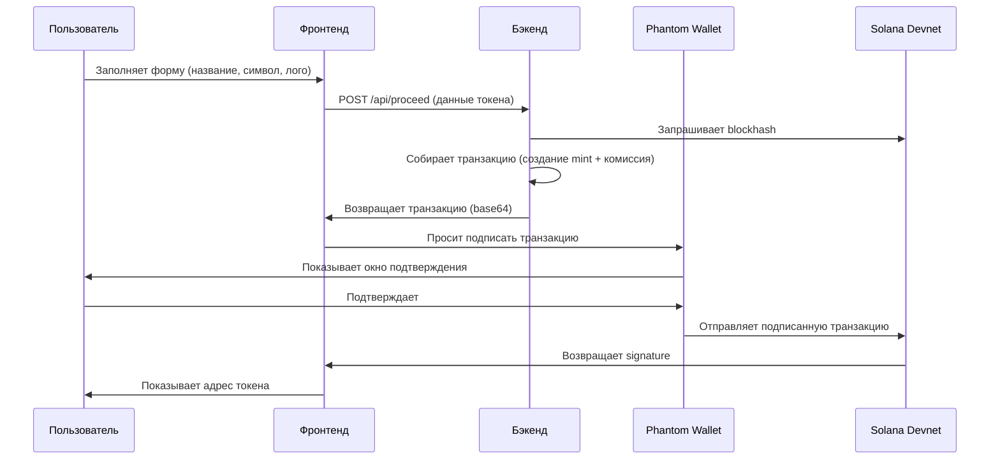
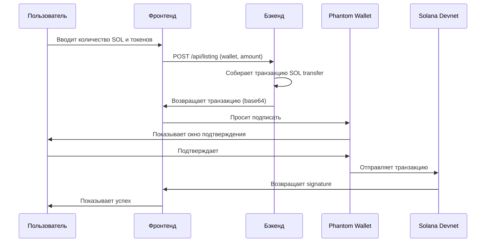

# Основные пайплайны проекта

В проекте 2 главных процесса: создание токена и создание пула ликвидности.

---

## Пайплайн 1: Создание токена

### Что делает
Пользователь заполняет форму (название, символ, лого), нажимает кнопку — получает новый токен на Solana.

### Схема процесса



### Входные данные
```json
{
  "wallet": "адрес кошелька пользователя",
  "name": "название токена",
  "symbol": "символ (например BTC)",
  "decimals": 9,
  "description": "описание токена",
  "metadata_uri": "ссылка на лого в IPFS",
  "priority_fee": 250000
}
```

### Что происходит внутри

1. **Бэкенд получает запрос** → проверяет что wallet валидный
2. **Создаёт mint адрес** → детерминированный (зависит от symbol)
3. **Собирает транзакцию:**
   - Создание аккаунта для mint
   - Инициализация mint (decimals, authority)
   - Добавление комиссии 0.02 SOL на CHARGE_TO
4. **Возвращает транзакцию** → фронт просит кошелёк подписать
5. **Кошелёк подписывает** → отправляет в Solana
6. **Токен создан** → показываем адрес пользователю

### Выходные данные
```json
{
  "success": true,
  "tx": "base64 транзакция для подписи",
  "mint": "адрес созданного токена",
  "seed": "seed для детерминированного адреса"
}
```

### Важные моменты

- **Сейчас используется SPL Token (не Token-2022)** — строка 22 в `utils/token_ops.py`
- **Метадаты не сохраняются on-chain** — параметры `name`, `description`, `metadata_uri` приходят, но не используются
- **Для Token-2022 с метадатами** нужно:
  1. Изменить `PROGRAM_ID` на Token-2022
  2. Добавить metadata extension инструкции
  3. Увеличить размер аккаунта под метадаты

---

## Пайплайн 2: Создание пула ликвидности (Raydium)

### Что делает
Пользователь создал токен, теперь хочет добавить ликвидность (SOL + токены) чтобы люди могли торговать.

### Схема процесса



### Текущее состояние

**⚠️ Raydium НЕ интегрирован** — строка 28 в `utils/raydium.py`: "Тут когда-нибудь добавим Raydium ix"

Сейчас `/api/listing` просто делает SOL transfer на CHARGE_TO (заглушка).

### Что нужно для реальной интеграции Raydium

1. **Создать Associated Token Account (ATA)** для пользователя
2. **Минтить токены** на ATA пользователя
3. **Вызвать Raydium initialize pool:**
   - Передать mint адрес токена
   - Передать количество SOL и токенов
   - Получить pool_id и lp_mint
4. **Вернуть pool_id** пользователю

### Входные данные (текущие)
```json
{
  "wallet": "адрес кошелька",
  "amount": 0.1
}
```

### Входные данные (будущие, для Raydium)
```json
{
  "wallet": "адрес кошелька",
  "mint_address": "адрес токена",
  "sol_amount": 1.0,
  "token_amount": 1000000,
  "decimals": 9
}
```

### Выходные данные (текущие)
```json
{
  "success": true,
  "tx": "base64 транзакция"
}
```

### Выходные данные (будущие, для Raydium)
```json
{
  "success": true,
  "tx": "base64 транзакция",
  "pool_id": "адрес пула Raydium",
  "lp_mint": "адрес LP токена"
}
```

---

## Итого

**Работает сейчас:**
- ✅ Создание SPL Token на devnet
- ✅ Детерминированный mint адрес
- ✅ Комиссия 0.02 SOL
- ✅ Подпись через Phantom

**Не работает (заглушки):**
- ❌ Token-2022 с метадатами
- ❌ Raydium пулы ликвидности
- ❌ Сохранение метадат on-chain

**Для перехода на Token-2022:**
1. Поменять `PROGRAM_ID` в `utils/token_ops.py`
2. Добавить metadata extension инструкции
3. Обновить тесты